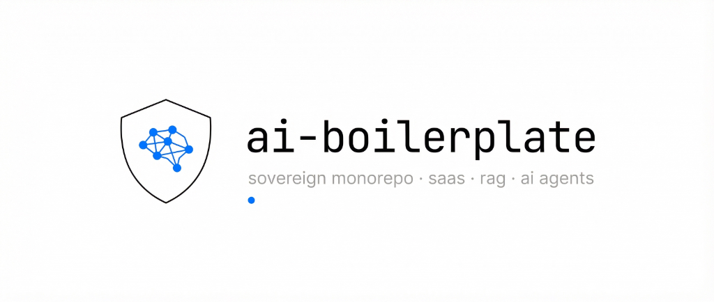

<div align="center">
  
  
  <br />
  <br />

  [](LICENSE)
  [](docker-compose.yml)
  [](backend/)
  [](frontend/)
  [](backend/)
  [](backend/app/models/document.py)

  **Production-ready monorepo boilerplate for building AI SaaS, RAG pipelines, and Autonomous Agents.**
  
  *Zero vendor lock-in · 100% self-hosted · One-click deploy*

  ---

  [Quick Start](#-quick-start) · [Architecture](#-architecture) · [AI Gateway](#-ai-gateway) · [Features](#-features) · [Stack](#-tech-stack) · [Project Structure](#-project-structure) · [Environment](#-environment-variables) · [Contributing](#-contributing)

</div>

---

## ✨ Why AI Boilerplate?

Building AI-powered applications means juggling databases, auth, queues, embeddings, multiple LLM providers, and infrastructure — before writing a single line of business logic.

**AI Boilerplate** solves this by giving you a **production-grade foundation** with three non-negotiable principles:

| Principle | What It Means |
|-----------|---------------|
| 🔒 **Zero Vendor Lock-in** | 100% self-hosted. No Supabase, Clerk, Firebase, or Auth0. Your data lives on **your** infrastructure. |
| 🔌 **AI Agnostic (Plug & Play)** | Swap between Ollama (local), OVH (sovereign EU), OpenAI, Anthropic, or Google by changing **one env variable**. Zero code changes. |
| ⚡ **Native Async** | Every layer — database, API, task queue, LLM calls — uses `async/await`. No thread pool hacks. Built for AI latency. |

---

## 🚀 Quick Start

```bash
# 1. Clone the repo
git clone https://github.com/YOUR_USER/ai-boilerplate.git
cd ai-boilerplate

# 2. Configure environment
cp .env.example .env

# 3. Launch everything (one command)
docker compose up -d --build
```

That's it. **6 containers** spin up automatically:

| Service | URL | Purpose |
|---------|-----|---------|
| 🐍 API | http://localhost:8000 | FastAPI backend |
| 📚 Docs | http://localhost:8000/docs | Interactive Swagger UI |
| 🛠 Admin | http://localhost:8000/admin | SQLAdmin CRUD panel |
| ⚛️ Frontend | http://localhost:3000 | React dashboard |
| 🐘 PostgreSQL | localhost:5432 | Database + pgvector |
| 🦙 Ollama | localhost:11434 | Local AI engine |

> **First run?** Pull a model for local AI:
> ```bash
> docker exec ai_ollama ollama pull llama3
> ```

---

## 🏗 Architecture

```
┌─────────────┐     HTTP      ┌──────────────┐      async      ┌──────────────┐
│  ⚛️ Frontend │─────────────▶│  🐍 FastAPI   │───────────────▶│  🐘 PostgreSQL│
│  React 19   │     :3000     │   + Auth      │     asyncpg    │  + pgvector   │
│  Vite 8     │               │   + SQLAdmin  │                │              │
└─────────────┘               └──────┬───────┘                └──────────────┘
                                     │
                              enqueue │ ARQ
                                     ▼
                              ┌──────────────┐     LiteLLM     ┌──────────────┐
                              │  ⚙️ Worker    │───────────────▶│  🦙 Ollama    │
                              │  ARQ (async) │                │  (local GPU) │
                              └──────┬───────┘                └──────────────┘
                                     │                                │
                              ┌──────┴───────┐               ┌───────┴──────┐
                              │  🔴 Redis     │               │  ☁️ Cloud LLMs│
                              │  Queue+Cache │               │  OpenAI/etc  │
                              └──────────────┘               └──────────────┘
```

### The Async Flow

1. **User** clicks "Process with AI" in the dashboard
2. **API** validates the request and enqueues it in **Redis** via ARQ
3. **API** returns `HTTP 202 Accepted` immediately (no blocking!)
4. **Frontend** shows a toast: *"Task queued. Processing in background..."*
5. **Worker** picks up the job, calls the **AI Gateway** (LiteLLM)
6. **LiteLLM** routes to the correct provider (Ollama / OpenAI / Anthropic / OVH)
7. **Worker** writes the AI summary + embeddings back to **PostgreSQL**
8. User refreshes dashboard → sees the completed result

---

## 🤖 AI Gateway

The **AI Gateway** is the heart of the zero-lock-in design. All LLM calls pass through a single function routed by `LiteLLM`:

```python
# Change the brain of your entire app with ONE env variable:
ACTIVE_LLM_PROVIDER="ollama/llama3"      # 🦙 Local (offline)
ACTIVE_LLM_PROVIDER="gpt-4o"             # ☁️ OpenAI
ACTIVE_LLM_PROVIDER="claude-3-7-sonnet"  # ☁️ Anthropic
ACTIVE_LLM_PROVIDER="gemini-1.5-pro"     # ☁️ Google
ACTIVE_LLM_PROVIDER="ovh/mixtral"        # 🇪🇺 EU Sovereign Cloud
```

```python
# backend/app/ai/llm_router.py — One function, all providers
async def generate_ai_response(prompt: str, model: str = None) -> str:
    active_model = model or settings.ACTIVE_LLM_PROVIDER
    
    if active_model.startswith("ollama/"):
        kwargs["api_base"] = settings.OLLAMA_API_BASE      # → Local container
    elif active_model.startswith("ovh/"):
        kwargs["api_base"] = settings.OVH_AI_BASE_URL      # → EU sovereign
    # else: LiteLLM handles OpenAI/Anthropic/Google natively
    
    return await acompletion(**kwargs)
```

> **SDK ban**: Direct use of `openai`, `anthropic`, or `google` SDKs in business logic is **strictly forbidden**. Everything goes through LiteLLM.

---

## 📋 Features

### Backend
- ✅ **FastAPI** — 100% async Python web framework
- ✅ **SQLModel + asyncpg** — Async PostgreSQL ORM with type safety
- ✅ **pgvector** — Vector embeddings for RAG (1536 dims, customizable)
- ✅ **FastAPI-Users** — JWT auth with bcrypt password hashing (self-hosted)
- ✅ **SQLAdmin** — Auto-generated admin panel at `/admin`
- ✅ **Alembic** — Database migrations with auto-applied `CREATE EXTENSION vector`
- ✅ **ARQ + Redis** — Async background task queue (no Celery)
- ✅ **LiteLLM** — Universal LLM routing (10+ providers)
- ✅ **Webhook receiver** — HMAC-SHA256 signed callbacks from async agents
- ✅ **Structured logging** — Production-ready Python logging throughout

### Frontend
- ✅ **React 19** — Latest React with hooks
- ✅ **TypeScript 5.9** — Strict mode enabled
- ✅ **Vite 8** — Blazing fast HMR and builds
- ✅ **TailwindCSS v4** — Utility-first CSS with new engine
- ✅ **shadcn/ui** — Accessible, composable components (Nova preset)
- ✅ **Axios + JWT interceptor** — Auto-injects Bearer tokens, redirects on 401
- ✅ **Toast notifications** — Non-blocking UX for async operations
- ✅ **Protected routes** — JWT-gated dashboard with auto-redirect

### Infrastructure
- ✅ **Docker Compose** — 6 services, one command, isolated network
- ✅ **GPU support** — NVIDIA CUDA pass-through for Ollama (graceful fallback)
- ✅ **Persistent volumes** — PostgreSQL, Redis, and Ollama model weights survive restarts
- ✅ **Health checks** — DB and Redis readiness checks before API starts
- ✅ **Hot reload** — Both backend and frontend code changes apply instantly

---

## 🛠 Tech Stack

| Layer | Technology | Version |
|-------|-----------|---------|
| **Backend** | FastAPI | 0.115 |
| **ORM** | SQLModel + SQLAlchemy | 0.22 / 2.0 |
| **Database** | PostgreSQL + pgvector | 16 |
| **Auth** | FastAPI-Users (JWT) | 13.0 |
| **Admin** | SQLAdmin | 0.20 |
| **Migrations** | Alembic | 1.14 |
| **Queue** | ARQ + Redis | 0.26 / 7 |
| **AI Router** | LiteLLM | 1.55 |
| **Local AI** | Ollama | latest |
| **Frontend** | React + TypeScript | 19 / 5.9 |
| **Bundler** | Vite | 8.0 |
| **CSS** | TailwindCSS | v4 |
| **Components** | shadcn/ui (Radix) | latest |
| **HTTP Client** | Axios | latest |

---

## 📁 Project Structure

```
ai-boilerplate/
├── .env.example                    # All environment variables
├── docker-compose.yml              # 6-service orchestration
│
├── backend/
│   ├── Dockerfile
│   ├── requirements.txt
│   ├── alembic.ini
│   ├── alembic/
│   │   ├── env.py                  # Async Alembic config
│   │   └── versions/
│   │       └── 001_initial.py      # CREATE EXTENSION vector + tables
│   └── app/
│       ├── main.py                 # FastAPI entrypoint (CORS, routers, SQLAdmin)
│       ├── worker.py               # ARQ background tasks
│       ├── core/
│       │   ├── config.py           # Pydantic Settings (env vars)
│       │   ├── database.py         # Async engine + session factory
│       │   └── security.py         # JWT strategy
│       ├── models/
│       │   ├── user.py             # User (FastAPI-Users)
│       │   └── document.py         # Document + pgvector embedding
│       ├── api/
│       │   ├── auth.py             # /api/auth/register, /api/auth/login
│       │   ├── documents.py        # CRUD + POST /api/documents/{id}/process
│       │   └── webhooks.py         # POST /api/webhooks/manus
│       └── ai/
│           ├── llm_router.py       # Universal LLM Gateway (LiteLLM)
│           └── manus_client.py     # Async agent dispatcher
│
└── frontend/
    ├── Dockerfile
    ├── package.json
    ├── vite.config.ts
    ├── components.json             # shadcn/ui config
    └── src/
        ├── main.tsx                # React entry
        ├── App.tsx                 # Router + toast provider
        ├── index.css               # TailwindCSS v4 + shadcn theme
        ├── lib/
        │   ├── api.ts              # Axios + JWT interceptor
        │   └── utils.ts            # shadcn utilities
        ├── components/ui/          # shadcn components
        │   ├── button.tsx
        │   ├── input.tsx
        │   ├── card.tsx
        │   ├── badge.tsx
        │   ├── label.tsx
        │   └── sonner.tsx
        └── pages/
            ├── LoginPage.tsx
            ├── RegisterPage.tsx
            └── DashboardPage.tsx
```

---

## 🔐 Environment Variables

Copy `.env.example` to `.env` and customize:

```bash
cp .env.example .env
```

| Variable | Purpose | Default |
|----------|---------|---------|
| `DB_PASSWORD` | PostgreSQL password | `secret_postgres_pass` |
| `DATABASE_URL` | Async DB connection string | `postgresql+asyncpg://...` |
| `REDIS_URL` | Redis connection | `redis://redis:6379/0` |
| `JWT_SECRET` | JWT signing secret | `super_secret_...` |
| `ACTIVE_LLM_PROVIDER` | **🧠 Active AI model** | `ollama/llama3` |
| `OLLAMA_API_BASE` | Local Ollama URL | `http://ia_local:11434` |
| `OVH_AI_API_KEY` | OVH sovereign cloud key | — |
| `OPENAI_API_KEY` | OpenAI API key | — |
| `ANTHROPIC_API_KEY` | Anthropic API key | — |
| `GEMINI_API_KEY` | Google AI key | — |
| `MANUS_API_KEY` | External agent key | — |
| `VITE_API_URL` | Frontend → Backend URL | `http://localhost:8000` |

---

## ✅ Acceptance Criteria

The project is considered production-ready when these 4 E2E tests pass:

| # | Test | Validates |
|---|------|-----------|
| 1 | **One-Click Deploy** | `docker compose up -d --build` starts 6 containers, Alembic auto-migrates, no crashes |
| 2 | **Offline / Zero-Trust** | With `ACTIVE_LLM_PROVIDER="ollama/llama3"` and internet off, register user + AI processing works via local container |
| 3 | **Hot-Swap** | Change to `ACTIVE_LLM_PROVIDER="claude-3-7-sonnet"`, restart worker → same task uses Anthropic. Zero code changes |
| 4 | **Admin UI** | http://localhost:8000/admin shows users and documents with full CRUD |

---

## 🤝 Contributing

Contributions are welcome! Please open an issue first to discuss what you'd like to change.

1. Fork the repository
2. Create your feature branch (`git checkout -b feat/amazing-feature`)
3. Commit your changes (`git commit -m 'feat: add amazing feature'`)
4. Push to the branch (`git push origin feat/amazing-feature`)
5. Open a Pull Request

---

## 📄 License

This project is licensed under the **MIT License** — see the [LICENSE](LICENSE) file for details.

---

<div align="center">
  <br />
  <strong>Built with ❤️ for the AI community</strong>
  <br />
  <sub>Stop configuring. Start building.</sub>
  <br />
  <br />
  
  ⭐ **Star this repo** if you find it useful!
</div>
